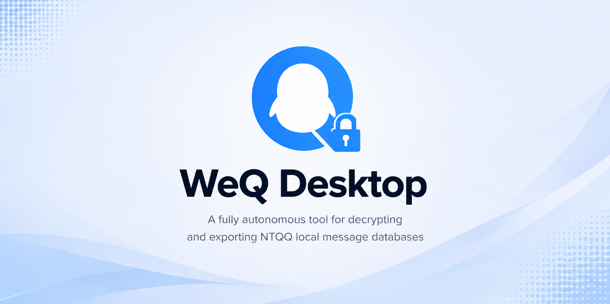

<div align="center">


**WeQ** 是一个 NTQQ 自主的本地消息数据库解密、解析与导出工具。

**欢迎加入QQ群交流** [](https://qm.qq.com/q/ysMZoAcC1a)

---

> [!Warning] 
>
> 本项目通过**直接发包**，或者**hook收包函数**等方式，提取数据库主密钥，注意相关风险
>
> *本项目仅用于个人数据的本地备份与分析，请勿用于任何违法用途。*

---

## ✨ 功能

- **高仿 QQ 界面** —— 聊天列表、联系人等核心界面**高度还原**
- **全消息类型适配** —— **PC 端消息类型全覆盖**，包括文本、图片、文件、引用、表情等
- **消息实时更新** —— **外部监听数据库**，变更时增量更新
- **媒体下载与查看** —— 本地/CDN媒体文件的提取与查看
- **数据库修改** —— 支持对解密后数据库的读写操作
- **多格式导出** —— 支持导出为 TXT、JSON、JSONL、SQLite、CSV、XLSX，<del>HTML</del>
- **群相册导出** —— 批量下载保存群相册到本地
- [ ] **已适配 ChatLab** —— 一键导入 [ChatLab](https://chatlab.fun/) 进一步分析
- [ ] 聊天分析 && 年度报告
- [ ] 开放api/MCP服务器
- [ ] 允许接入ai完成高度自定义的数据分析

## 使用方法

1. 前往 [Releases](../../releases) 下载最新版本
2. 按照引导操作获取数据库密钥 (**无需提前打开QQ**)
3. 打开对应账号即可开始使用

#### 开发者指南

> [!important]
>
>
> 强烈推荐使用 [pnpm](https://pnpm.io/)

```bash
pnpm i
pnpm dev
```

#### 项目结构

```
WeQ/
├── apps/
│   └── desktop/          # Electron 前端代码
└── packages/
    ├── account/          # 账号会话管理
    ├── codec/            # Protobuf 解析
    ├── db/               # 数据库读写方法
    ├── native/           # 原生模块（密钥提取等）
    ├── platform/         # 跨平台路径适配（目前仅 win32）
    ├── protocol/         # QQ 协议部分实现
    └── service/          # 前端调用的业务方法
```

## 相关项目推荐 && 致谢

- **微信聊天记录导出：** [WeFlow](https://github.com/hicccc77/WeFlow/tree/93d46a3183b98bfe5073ea89ecaa32a4f80f79d3)

- **微信高仿 & 数据分析：** [WeChatDataAnalysis](https://github.com/LifeArchiveProject/WeChatDataAnalysis)

  ---

- **[NapNeko](https://github.com/NapNeko)** —— **大量实现参考**，不限于native实现思路，消息结构和字段枚举
- **[webark-im-template](https://github.com/dogxii/webark-im-template)** —— QQ 聊天界面模板
- **[QQBackup](https://github.com/QQBackup)** —— 整理了大量QQ数据库相关信息

**同时也感谢每一个为WeQ及相关项目做出贡献的开发者**：

<a href="https://github.com/H3CoF6/WeQ/graphs/contributors">
  
</a>

## Star History

[](https://star-history.com/#H3CoF6/WeQ&Date)